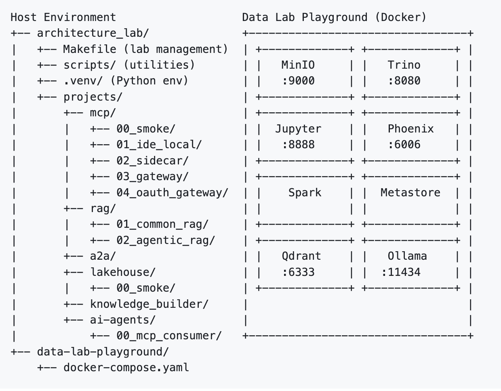

# Code First, Then Write

## My New Way of Architecting

This is a follow-up to my earlier article
**[AI-assisted coding, in the hands of a pro](../AI-assisted-coding_in-the-hands-of-a-pro/index.md)**,
where I described how one of our top developers, Tarek Abouzeid, used AI-assisted coding to build a complete analytics stack — the *Data-Lab Playground*.

I ended that article with a promise:

> “That’s when I started my next project, *AI Architecture Lab*, using AI to accelerate my job as architect.”

This article is about that project — and more importantly, about a shift in *how* I now do architecture.

---

## From diagrams to running proof

For most of my career, architecture has followed a familiar rhythm:

1. Think
2. Draw
3. Write
4. Review
5. Argue
6. Implement (much later, by someone else)

That model breaks down when the subject itself is fast-moving, software-defined, and highly emergent — which is exactly what we are dealing with in modern AI platforms, GenAI, and agentic systems.

What I needed was not *better diagrams*, but a way to:

* Make architectural ideas **executable**
* Reduce opinion and increase **evidence**
* Test assumptions early, cheaply, and repeatedly
* Learn by *building*, not speculating

That led to the **Architecture Lab**.

---

## What the Architecture Lab is

The Architecture Lab is a repeatable architectural workbench, built on top of an existing analytics playground. It allows me to turn architectural ideas into small, self-contained, runnable projects — without touching the underlying platform.

At a structural level, the lab deliberately separates architectural experiments from the shared execution environment they depend on. 

The Architecture Lab itself lives in the host environment and contains only orchestration, experiments, and evidence.  
All heavy infrastructure — storage, compute, observability, and LLM runtime — is provided by the shared Data Lab Playground, running independently beneath it.

This separation is intentional. It allows architectural ideas to be tested, compared, and discarded without destabilizing the platform they rely on.

Each project:

* Focuses on **one architectural idea**
* Is small enough to run in a day
* Produces **evidence**, not slides
* Leaves behind artifacts: code, benchmarks, traces, and decisions

I often summarize the philosophy as:

> **One Day, One Proof**

This is not about building products.
It is about **testing architecture itself**.

---

## Code first, documentation later

The biggest change for me has been the order of work.

Instead of:

> *Write architecture → then see if it works*

I now do:

> *Code a minimal system → observe → then write*

The documentation — ADRs, diagrams, recommendations — comes **after** something has actually run.

This flips the role of code:

* From “implementation detail”
* To **architectural instrument**

AI-assisted coding makes this feasible at an architectural level. I can move fast enough to explore ideas myself, without turning every thought experiment into a multi-team initiative.

---

## Evidence as a first-class output

Every project in the lab is expected to produce evidence. Not benchmarks for their own sake, but **signals that answer architectural questions**, such as:

* What latency does this pattern introduce?
* Where does complexity actually move?
* Which part becomes the bottleneck?
* What breaks first when we add security?
* What is observable — and what is not?

Evidence typically comes in the form of:

* Structured benchmarks with pass/fail criteria
* Execution traces (for AI and agent workflows)
* Logged decision points
* Explicit trade-offs captured in ADRs

If an idea cannot be observed, measured, or falsified, it does not belong in the lab.

---

## Domains, not demos

The lab is organized around **architectural domains**, not technologies or vendors. Each domain represents an area where architectural uncertainty exists today.

Examples include:

### Model Context Protocol (MCP)

Exploring how MCP patterns evolve from local development to enterprise-grade deployment, including:

* IDE-local servers
* Sidecar patterns
* Gateways
* OAuth-secured enterprise variants

The focus is not “does MCP work”, but:

> *What changes architecturally as we move along that spectrum?*

---

### AI Agents

Instead of validating infrastructure with synthetic tests, agents are used as **real workloads**.

Multi-step agents stress:

* Tool invocation
* State handling
* Latency sensitivity
* Error propagation
* Observability

This answers a more relevant question:

> *Does this architecture hold under realistic agent behavior?*

---

### Agent-to-Agent (A2A)

Here the lab is used to evaluate emerging A2A protocols:

* Capability discovery
* Delegation
* Failure handling
* Traceability across agent boundaries

The goal is not protocol compliance, but architectural understanding:

> *What does agent coordination cost us — and where?*

---

### RAG and Knowledge Systems

Rather than arguing about “RAG vs agentic RAG”, both patterns are implemented and observed side by side:

* Where does reasoning help?
* Where does it just add latency?
* What becomes harder to debug?

---

### Lakehouse (paused, intentionally)

Even paused work stays visible — including failures.
That, too, is an architectural result.

---

## Guardrails: how the lab stays useful

To avoid becoming yet another playground that slowly rots, the Architecture Lab follows a few strict rules:

* **Isolation**
  The base platform is never modified. All experiments are layered on top.

* **Repeatability**
  A project must work from a clean start. If it doesn’t, it’s not a valid architectural signal.

* **Least privilege**
  Security is introduced early, not “later”.

* **No production data**
  Synthetic or demo data only — always.

* **Decisions must be written down**
  Every project ends with an ADR. No exceptions.

These constraints are what make the results transferable to real enterprise discussions.

---

## Why this matters (to me)

I’ve spent much of my career moving between:

* Research and industry
* Platforms and products
* Central teams and local teams
* Theory and operations

What I see now, especially in AI and agentic systems, is a growing gap between:

* How fast ideas move
* And how slowly architecture adapts

The Architecture Lab is my attempt to close that gap — by making architecture **hands-on again**, without losing rigor.

It lets me show, not tell.

---

## Architecture as a living practice

The lab is never “done”. That is the point.

Some projects will be retired.
Some conclusions will be overturned.
Some patterns will fail outright.

But every failure leaves behind something valuable:
**understanding grounded in reality**.

That is now how I prefer to architect.

---

## Acknowledgments

This work would not exist without:

* **AI-assisted coding**, primarily using Claude Sonnet 4.5 via Github Copilot agent mode
* **Tarek Abouzeid’s** foundational work on the
  [data-lab-playground](https://github.com/tarekabouzeid/data-lab-playground)

This project is a concrete example of what human-AI collaboration can look like when used not to replace expertise — but to *amplify architectural thinking*.

