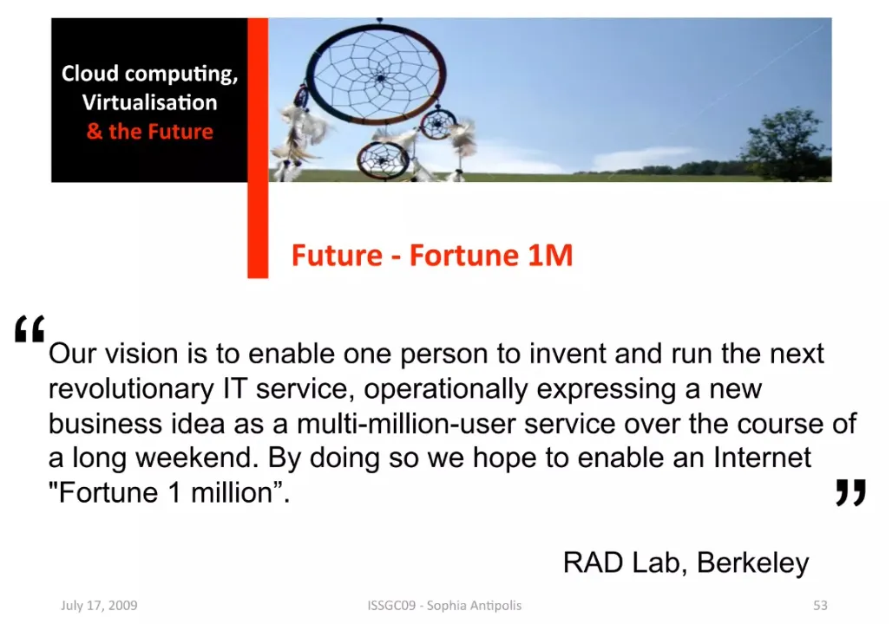
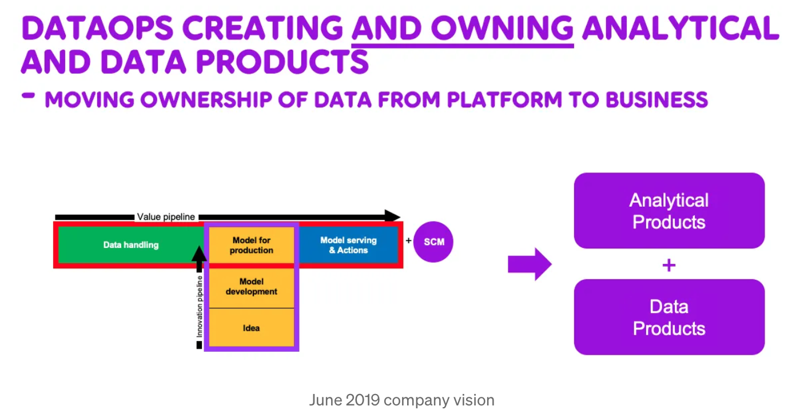

# Fortune 1 million is here, also in Analytics

*Originally published on [Medium](https://medium.com/@ake.edlund/fortune-1-million-is-here-also-in-analytics-c537162dc54b) on February 7, 2023*

"When (2013) I swiped my personal credit card on AWS, some of my co-founders did the same, and we started building," Ghodsi recalled. "You can get end users much quicker access to the thing you are building. We just built this startup from nothing on AWS without even talking to anyone there."

There's more in [that article](https://siliconangle.com/2022/11/29/building-databricks-top-aws-ceo-ali-ghodsi-says-change-coming-major-cloud-providers-reinvent/), for example referring to yet another great 'Berkeley view' report, this time about the [future of cloud](https://arxiv.org/abs/2205.07147).

But, what Ali Ghodsi, co-founder of Databricks, describes also connects so well to my favourite vision statement from Berkeley's [RAD Lab](https://radlab.cs.berkeley.edu/) (predecessor to AMP Lab, where Apache Spark was born, and where e.g. Ali Ghodsi and his partners were working):

> "Our vision is to enable one person to invent and run the next revolutionary IT service, operationally expressing a new business idea as a multi-million-user service over the course of a long weekend. By doing so we hope to enable an Internet 'Fortune 1 million'."

I used that vision statement in my slides at that time, 2009-ish, and onwards for example [below](https://www.slideshare.net/ISSGC/session-58-cloud-computing-virtualisation-and-the-future-speaker-ake-edlund). I spent quite some time for a few years preaching what cloud would mean for startups. I even got paid to write and present such obvious things back then.

Now, why am I writing about this? Besides 'reminisce' and the joy of seeing some visions come true? See this as a continuation from [earlier sharing](https://medium.com/@ake.edlund/decision-intelligence-yes-please-19ea9e66fa26) of challenges, and what we did to improve.

> I believe strongly that we're there now with respect also to data analytics, the 'Fortune 1M' stage.

There are two obvious points I'm trying to make here:

- We can all do much more with less today. With the right setup, you do not need huge budgets and staffing.
- We are now in the state where we put analytics into production, where we finally will start scaling up the value of analytics.

## Drew Convay's Venn diagram — not so broken anymore

Remember that [Venn diagram](http://drewconway.com/zia/2013/3/26/the-data-science-venn-diagram) I talked about [last time](https://medium.com/@ake.edlund/decision-intelligence-yes-please-19ea9e66fa26)? Not everyone has seen this diagram, many newcomers into the field joined after the diagram was split in 2–3–4 pieces. Rightfully split. You can't be all that in one person. No, but over time you can get quite close, especially due to all the advances in underlying platforms: you can, more than ever, stand on the shoulders of giants.

You can do so much more alone or just with two persons, from start to end, using today's technologies and developments. One person knowing how to handle data and develop models, one knowing the target area.

Why am I making a difference from first example, on building a company using your credit card and public cloud services vs doing the same in analytics?

As we all know, making decisions from data by letting the Machine Learn from examples, hence leaving much of the programming to the computer has its challenges: part of the code is the data flowing in.

When reality changes so does the data reflecting the reality, and if your Machine Learned a pattern on old data you will see a degradation in performance, a drift.

## Our way towards a better way of working

To handle all this efficiently you need a good end-to-end setup, making use of all the DevOps and DataOps techniques we already use for development and data engineering.

In mid 2018 in the company I'm working at, [Telia Company](https://www.teliacompany.com/en), we started drafting a better way, how we would like to develop analytical products in a much more scalable and faster way than before.

DataOps was in focus, and we looked mainly at work from the [DataOpsManifesto](https://www.dataopsmanifesto.org/) guys, but we also had good help from the early sharing of experiences from other companies, and especially the [Gojek](https://www.gojek.com/) company was helpful in sharing how they tried different workflows in their pursuit of MLOps. Kudos to Gojek, really nice sharing.

## Leaving the POC graveyard shift

Getting into MLOps was not due to following a new 'hype' but driven by our analytics teams' need. The list of one-off analytics POCs was growing, and production of solutions often meant hand holding the models, or worse, throwing the models over the fence to the user — hoping it would work, never to see it in action again. We could not scale, there was a limited number of models we could handle per person, all very fragile (if something needed to be updated or changed — we had to work our way back in a manual tedious manner).

## Change in way of working as well as supporting architecture

So, what did we envision as a good model?

We saw a T-shape Production/Innovation pipeline — where domain centric cross functional teams would be creating and maintaining data and analytical products — resulting in a fully functional end to end MLOps machinery.

Without getting technical, we'll do that next time, above is the vision from June 2019, where the value pipeline would be all MLOps while the Innovation dito allowing for exploration and easy updates of models in production.

It took quite some time to get us from vision to where we are today. Initially we focused on our on-premise environments (MLflow and similar, at a start, now more towards the Kubeflow landscape).

What first got us all the way to true MLOps was when we moved our focus to the public cloud. Much has happened around MLOps in the public cloud, and all cloud providers have made enormous improvements in that area.

So, there's nothing stopping us now if we want to build analytical solutions end to end, truly end to end. From data, to inference, including reuse, feature stores, monitoring of drift (data and model). All the bells and whistles are there (some still to be evaluated). No excuse not to build a Fortune 1 million business, and no more POC graveyards.

---

*Tags: MLOps, Machine Learning, AI, Decision Making*
