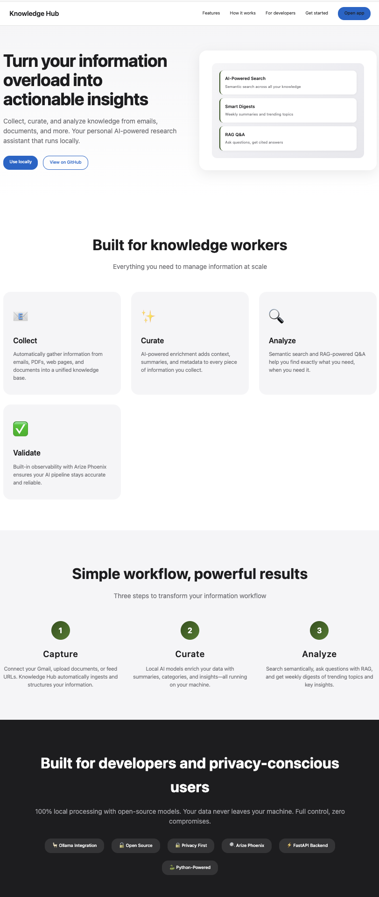
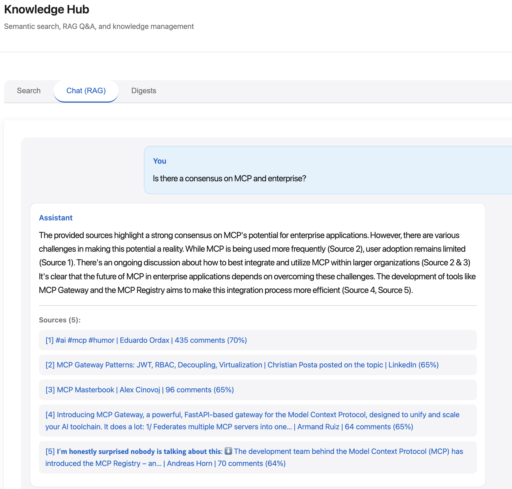

# AI Augmented: Your Creativity Is the Limit Now

*Published: November 16, 2025*

As you’ve  probably seen, all over the web, people do amazing things with the latest AI technology. Tons of posts showing what is possible, even if not always useful (especially not for enterprises). 

New companies are launched like rockets to the sky, and many still are made void by new releases by the very frameworks they built their business on. 

The complaints about yet another bubble, and reports about poor ROI are stacking up. Hype, doomers, people playing the bubble market. Yes, worrying times. Prices have decreased a lot, but we’ve seen that pattern earlier when fighting about market shares.

Business as usual, just accelerated.

Those worries aside, let’s look at what you can do for your own needs. Not to publish or sell, just create solutions to problems you have, and see what happens. 

And, to avoid being too naive, I focused on what I can do on my own laptop. In my dreams I would have my environment air gapped, but for now it’s ok as long as I get my local models and open source frameworks.

**Problem number one: How to keep up with new technologies, ideally using the same tech?**

I’m hoarding information on the web, articles and posts, that I intend to read more carefully ‘one of these days’. Some are really good, and they drown in the flood. I’m selective, still I have 500+ articles to grasp. 

Disclaimer: Yes, I know there are plenty of services that do this already. I've tested a few, and they are great, and I use them now-and-then, but I wanted to build it myself, to learn, and to be in control of my own data. And never underestimate *the joy of rediscovery.*

**Solution:**

Write a description of what I want, in a context.md. I want a solution that can take a link, go out and get the information the link is pointing to (post, pdf, …), summarize it, tag it, get some grading of comments (if a post), let me grade it, let me add notes to it, make it searchable. And more.

Using VS Code, agent mode, pointing at the context.md, and start iterate. 

The more I worked with this, local-never-to-release-to-anyone-else, I started to wake up, thinking wider, feeling more and more free. Ideas didn’t take months to take shape. Hours, less.

All good, I got a service that, to my surprise, I actually used (still use) daily, that really helped in my collections of information.

But. Collection is the first step, ensuring that I don’t lose any gems I’ve found. Yes, I could search the material, but still.

**Second problem: Not efficient enough.**

I kept mailing myself links, and they stacked up. I manually dropped these into my web solution (that crawled the linked content), but it still felt like a really dumb way of working. Yes, I created a way to take in batches of links, but still. We’re in the so called agent time now, manual isn’t the way to work. 

So I got help again (from my AI assistant, some googling, and ChatGPT) to download and extract Google mails, instead of the manual ingestion step (BTW, if you ever think about doing this: create a separate gmail, do all the OATH 2+).

Ok. Good. I got a way to collect and use my hoarded information. But still, that didn’t  help that much. 

And here’s one observation: you’re a very demanding customer (not in a bad sense). As the solution expands, the more ideas you get.

And that’s a key finding: your creativity is not hindered. Period. It takes a moment to grasp that it is you that is the limiting factor. *That it is you who need to get up to speed, not the technology that is slow.*

**Next step: Analysis, insights, trends.**

So, what did I do next? 

I ‘Talked’ to various AI (good practice, ‘play’ the AI:s against each other), proposing the idea of wrapping it all up into a Knowledge Hub: collect, curate, analyse. Where ‘analyse’ should be, beside earlier search:  ‘this week’, ‘trends’, ‘chat with the information’ (RAG solution). 

Some hours later it was all in place. Collecting and curating new findings into the 'platform' is now really smooth, even if the embeddings of the data takes longer (running local, all on my Mac).

**Next?**

Tune above. Use validation techniques (Arize Phoenix and more) to get it as good a possible. Deepen the analysis angles, maybe add graphs to get deeper insights. Or something (for sure something) more.

*Your creativity is the only limit now.*

In my next writing, I’ll show what I did with **AI to accelerate my job as architect.**

